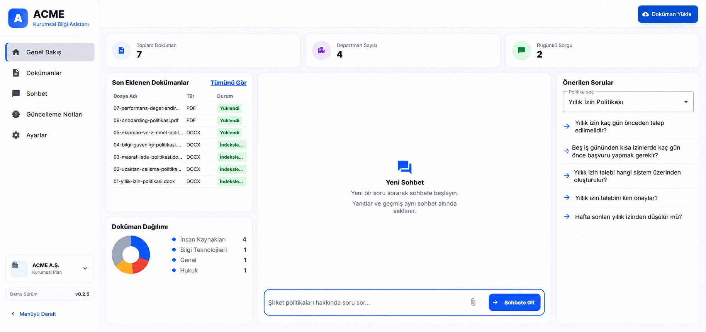
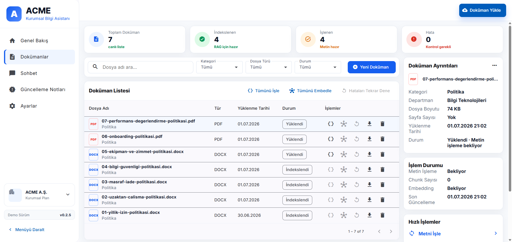
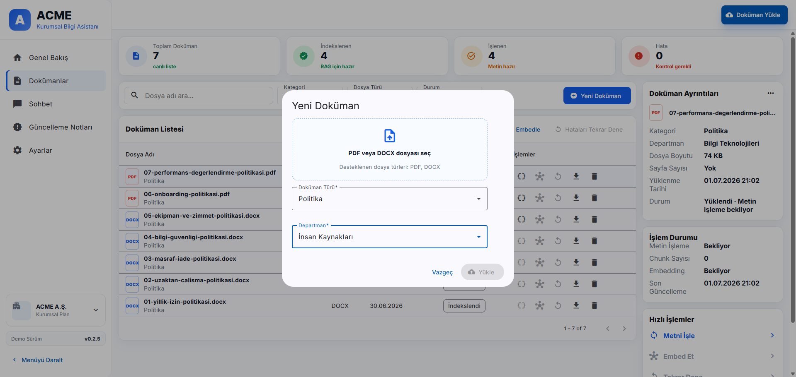
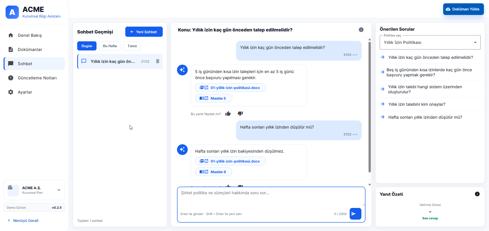
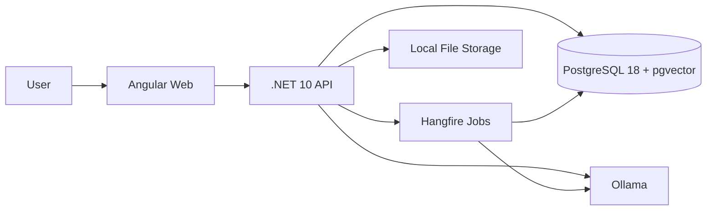
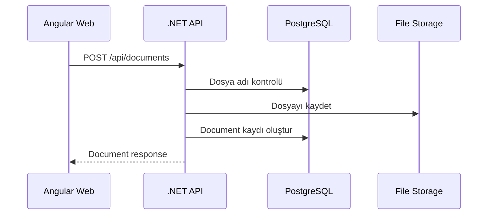
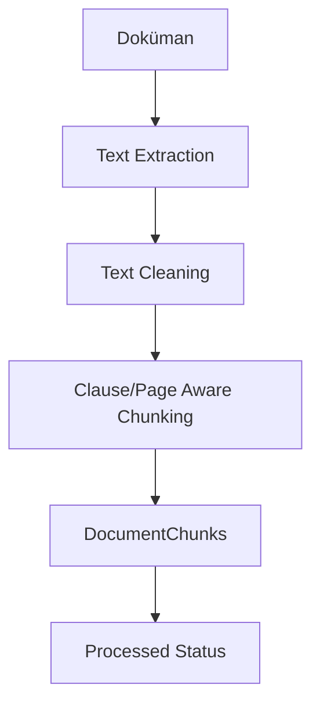
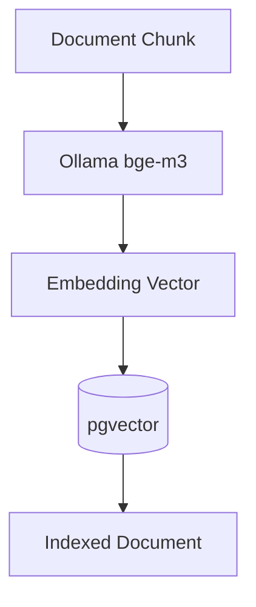
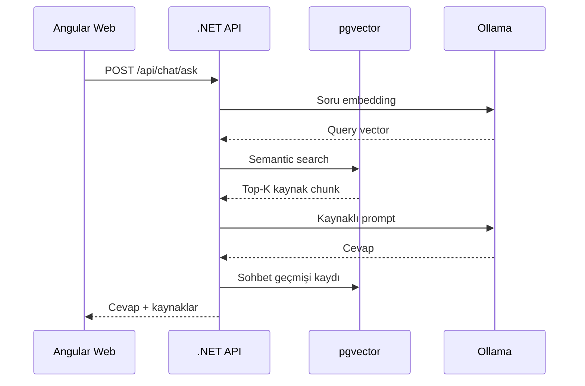

# Company Knowledge RAG Assistant

Şirket içi dokümanları yükleyen, işleyen, PostgreSQL + pgvector üzerinde semantik arama yapan ve Ollama ile kaynaklı cevaplar üreten açık kaynaklı bir RAG asistanı projesidir.

Bu proje .NET 10 backend, Angular 22 frontend, PostgreSQL 18 + pgvector, Ollama ve Hangfire kullanılarak geliştirilmiş bir MVP/demo çalışmasıdır.

<a id="on-izleme"></a>

## Ön İzleme

### Ana Sayfa

<a href="assets/readme/home.png">
  
</a>

### Doküman Yönetimi

<a href="assets/readme/documents.png">
  
</a>

<a href="assets/readme/document-2.png">
  
</a>

### Sohbet ve RAG Cevabı

<a href="assets/readme/chat.png">
  
</a>

## İçindekiler

1. [Projenin Amacı](#projenin-amaci)
2. [Öne Çıkan Özellikler](#one-cikan-ozellikler)
3. [Mimari](#mimari)
4. [Backend Mimarisi](#backend-mimarisi)
5. [RAG Akışı](#rag-akisi)
6. [Kullanılan Teknolojiler](#kullanilan-teknolojiler)
7. [Lokal Çalıştırma](#lokal-calistirma)
8. [Veritabanı Migration](#veritabani-migration)

<a id="projenin-amaci"></a>

## Projenin Amacı

- Şirket dokümanlarını merkezi bir bilgi tabanına almak.
- PDF ve DOCX dosyalarından metin çıkarmak.
- Metni sayfa, başlık ve madde farkındalığıyla parçalara ayırmak.
- Her parçayı embedding modelinden geçirip vektör olarak saklamak.
- Kullanıcı sorularını semantik arama ile ilgili doküman parçalarına bağlamak.
- LLM cevabını sadece bulunan kaynaklara dayalı şekilde üretmek.
- Doküman işleme ve embedding işlemlerini arka plan job’larıyla yönetmek.

<a id="one-cikan-ozellikler"></a>

## Öne Çıkan Özellikler

- Doküman yükleme: PDF ve DOCX dosya desteği.
- Metin çıkarma: PDF için PdfPig, DOCX için OpenXML.
- Chunking: Madde, başlık ve sayfa farkındalığı olan metin parçalama.
- Embedding: Ollama üzerinden `bge-m3`.
- Chat modeli: Ollama üzerinden `qwen2.5:1.5b`.
- Semantik arama: PostgreSQL + pgvector.
- Kaynaklı cevap: Cevap yanında doküman, madde ve sayfa bilgisi.
- Sohbet geçmişi: Oturum bazlı soru-cevap geçmişi.
- Arka plan işleri: Hangfire ile process/embed/retry ve toplu işlemler.
- API dokümantasyonu: Development ortamında Scalar.
- Modern frontend: Angular 22 + Angular Material.
- Docker desteği: Web, API, PostgreSQL ve Ollama servisleri.
- Production hazırlığı: GHCR image publish ve Ansible deployment akışı.

<a id="mimari"></a>

## Mimari



### Ana Bileşenler

- `Web`: Angular 22 frontend uygulaması.
- `Api`: .NET 10 Minimal API backend.
- `PostgreSQL + pgvector`: Doküman, chunk, sohbet ve vektör verileri.
- `Ollama`: Lokal embedding ve chat modeli.
- `Hangfire`: Uzun süren doküman işleme ve embedding işleri.
- `Docker Compose`: Lokal geliştirme ortamı.

<a id="backend-mimarisi"></a>

## Backend Mimarisi

Backend feature bazlı, vertical slice yaklaşımına yakın bir yapıdadır. Her ana kullanım senaryosu kendi klasörü altında endpoint, model, response ve handler mantığıyla ayrılır.

Örnek yapı:

```text
CompanyKnowledgeApi/
  Features/
    Documents/
    Ingestion/
    Search/
    Chat/
    Home/
  Infrastructure/
    Ai/
    BackgroundJobs/
    Documents/
    Storage/
  Database/
```

Bu yaklaşımda amaç, iş kurallarını teknik katmanlara dağıtmak yerine ilgili özelliğin yanında tutmaktır.

<a id="rag-akisi"></a>

## RAG Akışı

### 1. Doküman Yükleme

Kullanıcı frontend üzerinden PDF veya DOCX dosyası yükler.

API tarafında:

1. Dosya adı kontrol edilir.
2. Dosya local storage alanına kaydedilir.
3. Doküman kaydı veritabanına eklenir.
4. Doküman başlangıç statüsüyle listelenir.



### 2. Metni İşleme

Kullanıcı dokümanı işlediğinde veya toplu işlem başlattığında Hangfire job kuyruğa alınır.

API tarafında:

1. Job kuyruğa alınır.
2. Dosya storage’dan okunur.
3. PDF/DOCX extractor çalışır.
4. Metin temizlenir.
5. Chunking yapılır.
6. Chunk kayıtları veritabanına yazılır.
7. Doküman statüsü güncellenir.



### 3. Embedding

Metni işlenmiş doküman için embedding job çalışır.

API tarafında:

1. Her chunk Ollama embedding modeline gönderilir.
2. Dönen vektör pgvector formatında saklanır.
3. Doküman `Indexed` durumuna alınır.
4. RAG için aranabilir hale gelir.



### 4. Sohbet ve Kaynaklı Cevap

Kullanıcı sohbet ekranından soru sorar.

API tarafında:

1. Soru embedding modelinden geçirilir.
2. pgvector üzerinde semantik arama yapılır.
3. En alakalı chunk’lar seçilir.
4. Prompt yalnızca bu kaynaklarla oluşturulur.
5. Chat modeli cevap üretir.
6. Cevap, kaynak bilgileriyle birlikte döner.
7. Soru ve cevap sohbet geçmişine kaydedilir.



<a id="kullanilan-teknolojiler"></a>

## Kullanılan Teknolojiler

### Backend

- .NET 10
- ASP.NET Core Minimal API
- Entity Framework Core 10
- PostgreSQL provider: Npgsql
- pgvector EF Core entegrasyonu
- Scalar API Reference
- FluentValidation
- Hangfire + Hangfire.PostgreSql
- PdfPig
- DocumentFormat.OpenXml

### Frontend

- Angular 22
- Angular Material
- RxJS
- TypeScript

### AI ve Veri

- Ollama
- `bge-m3` embedding modeli
- `qwen2.5:1.5b` chat modeli
- PostgreSQL 18
- pgvector

### DevOps

- Docker Compose
- GHCR
- Ansible
- Nginx reverse proxy
- Cloudflare DNS/SSL

<a id="lokal-calistirma"></a>

## Lokal Çalıştırma

### Gereksinimler

- Docker Desktop
- .NET 10 SDK
- Node.js `^22.22.3`, `^24.15.0` veya `>=26.0.0`
- Ollama modelleri için yeterli RAM

### Docker ile Başlatma

```bash
docker compose up -d --build postgres ollama api web
```

Servisler:

- Frontend: `http://localhost:4200`
- API: `http://localhost:8080`
- Health: `http://localhost:8080/health`
- Scalar: `http://localhost:8080/scalar`
- Hangfire Dashboard: `http://localhost:8080/hangfire`

> Hangfire dashboard sadece development ortamında açıktır. Production ortamında kapalı tutulur.

### Ollama Modelleri

Container içinde modelleri indirmek için:

```bash
docker exec company-knowledge-ollama ollama pull bge-m3
docker exec company-knowledge-ollama ollama pull qwen2.5:1.5b
```

<a id="veritabani-migration"></a>

## Veritabanı Migration

Migration oluşturma:

```bash
dotnet ef migrations add MigrationName --project CompanyKnowledgeApi --startup-project CompanyKnowledgeApi
```

Migration uygulama:

```bash
dotnet ef database update --project CompanyKnowledgeApi --startup-project CompanyKnowledgeApi
```

Production için idempotent SQL üretme:

```bash
dotnet ef migrations script --idempotent --project CompanyKnowledgeApi --startup-project CompanyKnowledgeApi --output migration.sql
```
