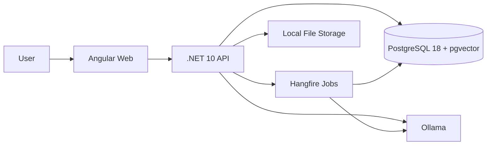
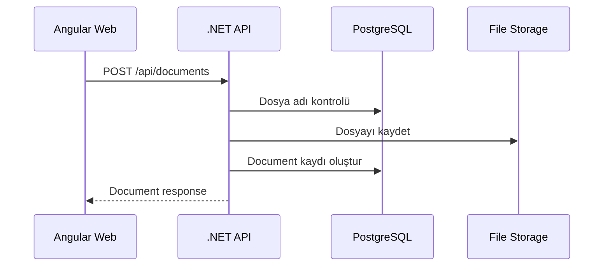
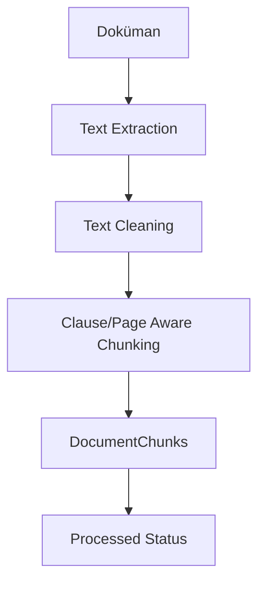
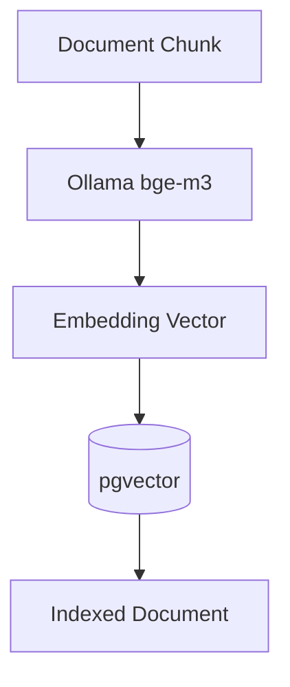
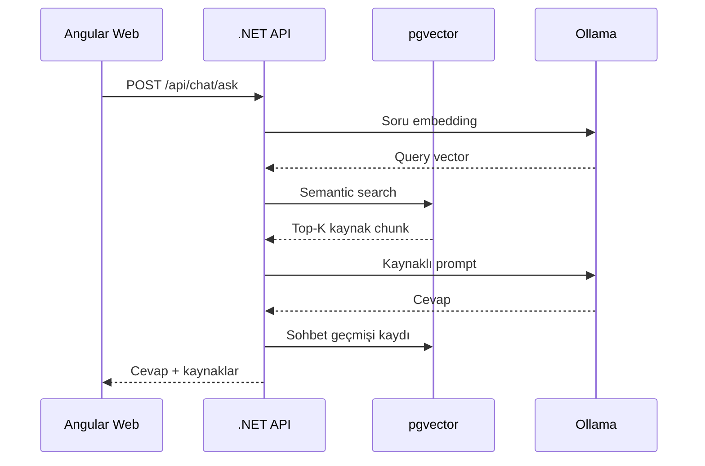

# Company Knowledge RAG Assistant

Şirket içi dokümanları yükleyip işleyen, PostgreSQL + pgvector üzerinde semantik arama yapan ve Ollama ile kaynaklı cevap üreten açık kaynak RAG asistanı.

Bu proje; .NET 10 backend, Angular 22 frontend, PostgreSQL 18 + pgvector, Ollama ve Hangfire kullanılarak hazırlanmış bir MVP/demo projedir. Amaç; CV ve portföy için gerçekçi bir kurumsal bilgi asistanı senaryosunu uçtan uca göstermektir.

> Görselleri sonradan eklemek için önerilen klasör: `assets/readme/`

## Ön İzleme

> Aşağıdaki görsel/GIF dosyalarını eklediğinde GitHub üzerinde doğrudan görünecek.


## Projenin Amacı

- Şirket dokümanlarını merkezi bir bilgi tabanına almak.
- PDF ve DOCX dosyalarından metin çıkarmak.
- Metni sayfa, başlık ve madde farkındalığıyla parçalara ayırmak.
- Her parçayı embedding modelinden geçirip vektör olarak saklamak.
- Kullanıcı sorularını semantik arama ile ilgili doküman parçalarına bağlamak.
- LLM cevabını sadece bulunan kaynaklara dayalı şekilde üretmek.
- Doküman işleme ve embedding işlemlerini arka plan job’larıyla yönetmek.

## Öne Çıkan Özellikler

- Doküman yükleme: PDF ve DOCX dosya desteği.
- Tekrarlı dosya kontrolü: Aynı dosya adı ve uzantısı tekrar yüklenemez.
- Metin çıkarma: PDF için PdfPig, DOCX için OpenXML.
- Chunking: Madde, başlık ve sayfa farkındalığı olan metin parçalama.
- Embedding: Ollama üzerinden `bge-m3`.
- Chat modeli: Ollama üzerinden `qwen2.5:1.5b`.
- Semantik arama: PostgreSQL + pgvector.
- Kaynaklı cevap: Cevap yanında doküman, madde ve sayfa bilgisi.
- Sohbet geçmişi: Oturum bazlı soru-cevap geçmişi.
- Soft delete: Sohbet ve doküman kayıtlarında güvenli silme yaklaşımı.
- Arka plan işleri: Hangfire ile process/embed/retry ve toplu işlemler.
- API dokümantasyonu: Development ortamında Scalar.
- Modern frontend: Angular 22 + Angular Material.
- Docker desteği: Web, API, PostgreSQL ve Ollama servisleri.
- Production hazırlığı: GHCR image publish ve Ansible deployment akışı.

## Mimari



### Ana Bileşenler

- `CompanyKnowledgeWeb`: Angular 22 frontend uygulaması.
- `CompanyKnowledgeApi`: .NET 10 Minimal API backend.
- `PostgreSQL + pgvector`: Doküman, chunk, sohbet ve vektör verileri.
- `Ollama`: Lokal embedding ve chat modeli.
- `Hangfire`: Uzun süren doküman işleme ve embedding işleri.
- `Docker Compose`: Lokal geliştirme ortamı.

## Backend Mimarisi

Backend feature bazlı, vertical slice yaklaşımına yakın bir yapıdadır. Her ana kullanım senaryosu kendi klasörü altında endpoint, model, response ve handler mantığıyla ayrılır.

Örnek yapı:

```text
CompanyKnowledgeApi/
  Features/
    Documents/
    Ingestion/
    Search/
    Chat/
    Home/
  Infrastructure/
    Ai/
    BackgroundJobs/
    Documents/
    Storage/
  Database/
```

Bu yaklaşımda amaç, iş kurallarını teknik katmanlara dağıtmak yerine ilgili özelliğin yanında tutmaktır.

## RAG Akışı

### 1. Doküman Yükleme

Kullanıcı frontend üzerinden PDF veya DOCX dosyası yükler.

API tarafında:

1. Dosya adı kontrol edilir.
2. Dosya local storage alanına kaydedilir.
3. Doküman kaydı veritabanına eklenir.
4. Doküman başlangıç statüsüyle listelenir.



### 2. Metni İşleme

Kullanıcı dokümanı işlediğinde veya toplu işlem başlattığında Hangfire job kuyruğa alınır.

API tarafında:

1. Job kuyruğa alınır.
2. Dosya storage’dan okunur.
3. PDF/DOCX extractor çalışır.
4. Metin temizlenir.
5. Chunking yapılır.
6. Chunk kayıtları veritabanına yazılır.
7. Doküman statüsü güncellenir.



### 3. Embedding

Metni işlenmiş doküman için embedding job çalışır.

API tarafında:

1. Her chunk Ollama embedding modeline gönderilir.
2. Dönen vektör pgvector formatında saklanır.
3. Doküman `Indexed` durumuna alınır.
4. RAG için aranabilir hale gelir.



### 4. Sohbet ve Kaynaklı Cevap

Kullanıcı sohbet ekranından soru sorar.

API tarafında:

1. Soru embedding modelinden geçirilir.
2. pgvector üzerinde semantik arama yapılır.
3. En alakalı chunk’lar seçilir.
4. Prompt yalnızca bu kaynaklarla oluşturulur.
5. Chat modeli cevap üretir.
6. Cevap, kaynak bilgileriyle birlikte döner.
7. Soru ve cevap sohbet geçmişine kaydedilir.



## Kullanılan Teknolojiler

### Backend

- .NET 10
- ASP.NET Core Minimal API
- Entity Framework Core 10
- PostgreSQL provider: Npgsql
- pgvector EF Core entegrasyonu
- Scalar API Reference
- FluentValidation
- Hangfire + Hangfire.PostgreSql
- PdfPig
- DocumentFormat.OpenXml

### Frontend

- Angular 22
- Angular Material
- RxJS
- TypeScript

### AI ve Veri

- Ollama
- `bge-m3` embedding modeli
- `qwen2.5:1.5b` chat modeli
- PostgreSQL 18
- pgvector

### DevOps

- Docker Compose
- GHCR
- Ansible
- Nginx reverse proxy
- Cloudflare DNS/SSL

## Lokal Çalıştırma

### Gereksinimler

- Docker Desktop
- .NET 10 SDK
- Node.js `^22.22.3`, `^24.15.0` veya `>=26.0.0`
- Ollama modelleri için yeterli RAM

### Docker ile Başlatma

```bash
docker compose up -d --build postgres ollama api web
```

Servisler:

- Frontend: `http://localhost:4200`
- API: `http://localhost:8080`
- Health: `http://localhost:8080/health`
- Scalar: `http://localhost:8080/scalar`
- Hangfire Dashboard: `http://localhost:8080/hangfire`

> Hangfire dashboard sadece development ortamında açıktır. Production ortamında kapalı tutulur.

### Ollama Modelleri

Container içinde modelleri indirmek için:

```bash
docker exec company-knowledge-ollama ollama pull bge-m3
docker exec company-knowledge-ollama ollama pull qwen2.5:1.5b
```

## Veritabanı Migration

Migration oluşturma:

```bash
dotnet ef migrations add MigrationName --project CompanyKnowledgeApi --startup-project CompanyKnowledgeApi
```

Migration uygulama:

```bash
dotnet ef database update --project CompanyKnowledgeApi --startup-project CompanyKnowledgeApi
```

Production için idempotent SQL üretme:

```bash
dotnet ef migrations script --idempotent --project CompanyKnowledgeApi --startup-project CompanyKnowledgeApi --output migration.sql
```

## API Örnekleri

### Doküman Yükleme

```http
POST /api/documents
Content-Type: multipart/form-data
```

### Dokümanı İşleme

```http
POST /api/documents/{documentId}/process
```

### Dokümanı Embed Etme

```http
POST /api/documents/{documentId}/embed
```

### Soru Sorma

```http
POST /api/chat/ask
Content-Type: application/json

{
  "question": "Yıllık izin kaç gün önceden talep edilmelidir?",
  "topK": 4,
  "sessionId": null
}
```

## Ekranlar

### Genel Bakış

- Toplam doküman sayısı
- Departman dağılımı
- Bugünkü sorgu sayısı
- Son eklenen dokümanlar
- Önerilen sorular
- Sohbete yönlendirme


### Dokümanlar

- Doküman yükleme
- Kategori ve departman seçimi
- Metni işleme
- Embedding oluşturma
- Hataları tekrar deneme
- Toplu işlem butonları
- 10’lu frontend pagination


### Sohbet

- Sohbet geçmişi
- Bugün / bu hafta / tümü filtresi
- Aynı sohbet altında çoklu soru-cevap
- Kaynaklı cevap üretimi
- Önerilen RAG test soruları
- Son cevap süresi


### Ayarlar

- Demo modu bilgisi
- Kullanılan AI modelleri
- Veritabanı ve arama bilgisi
- Chunking yöntemi
- Sistem yapılandırma özeti


## Deployment Özeti

Production akışı:

1. Kod GitHub’a push edilir.
2. GitHub Actions Docker image build eder.
3. Image’lar GHCR’a gönderilir.
4. Ansible sunucuda Docker Compose dosyasını günceller.
5. API, web, postgres ve ollama servisleri ayağa kalkar.
6. Nginx `rag.pdrm.dev` subdomain’ini web ve API container’larına yönlendirir.

GHCR image örnekleri:

```text
ghcr.io/omerfurkanguney/companyknowledgeragassistant/company-knowledge-api:latest
ghcr.io/omerfurkanguney/companyknowledgeragassistant/company-knowledge-web:latest
```

## Production Notları

- Sunucu bilgileri repoda tutulmaz.
- Production secret değerleri `.env` dosyasıyla sunucuda yönetilir.
- Hangfire dashboard production ortamında kapalıdır.
- PostgreSQL, Ollama ve doküman storage için Docker volume kullanılır.
- Cloudflare + Nginx reverse proxy ile yayınlanır.

## Roadmap

- [x] .NET 10 backend mimarisi
- [x] PostgreSQL + pgvector
- [x] Doküman yükleme
- [x] Text extraction ve chunking
- [x] Ollama embedding
- [x] Semantik arama
- [x] Kaynaklı cevap üretimi
- [x] Angular frontend
- [x] Sohbet geçmişi
- [x] Hangfire job queue
- [x] Production Docker image publish
- [x] Ansible deployment hazırlığı
- [ ] Gelişmiş doküman görüntüleme
- [ ] Daha gelişmiş kaynak skorlama
- [ ] Adminsiz production health paneli
- [ ] Daha gelişmiş chunking stratejileri

## Dokümantasyon

- [Roadmap](docs/company-knowledge-rag-assistant-roadmap.md)
- [Faz 0 - Mimari Yapısı](docs/faz-0-mimari-yapisi.md)
- [Faz 1 - PostgreSQL + pgvector](docs/faz-1-postgresql-pgvector.md)
- [Faz 2 - Doküman Yükleme](docs/faz-2-dokuman-yukleme.md)
- [Faz 3 - Text Extraction + Chunking](docs/faz-3-text-extraction-chunking.md)
- [Faz 4 - Ollama Embedding](docs/faz-4-ollama-embedding.md)
- [Faz 5 - Semantic Search](docs/faz-5-semantic-search.md)
- [Faz 6 - Kaynaklı Cevap Üretimi](docs/faz-6-kaynakli-cevap-uretimi.md)
- [Faz 7 - Angular Frontend](docs/faz-7-angular-frontend.md)
- [Kullanılan Paketler](docs/kullanilan-paketler.md)
- [Temel Kavramlar](docs/temel-kavramlar.md)

## Lisans

Bu proje açık kaynak ve portföy/demo amaçlı geliştirilmiştir. Lisans bilgisi için repoya eklenecek `LICENSE` dosyası referans alınmalıdır.
